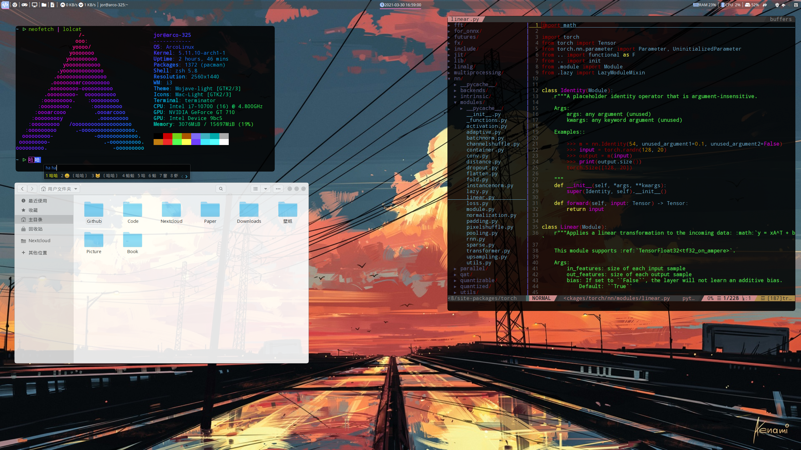
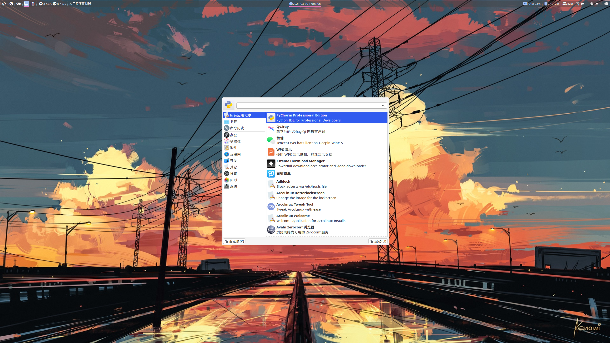

### 一些Linux的配置文件

为了装完系统之后快速配置环境，以及在个人电脑以及实验室电脑之间保持相同的操作习惯，所以将一些配置文件备份到这里

+ vim: 以及 ideavim 的配置文件
+ conda: 炼丹用
+ dunst: 自定义提示消息框
+ fcitx_skin: 自制fcitx皮肤clean_dark(也有一些网上搜刮的)，包括fcitx4以及fcitx5
+ i3: 日常使用的窗口管理器，使用 `yay -S i3-gaps-rounded-git` 可以获得圆角特性
+ picom: 窗口的透明度，过度效果等
+ polybar: 顶部的那个bar
+ rofi: 用来选择应用的，现在已经不用了，目前使用的是 xfce4-appfinder
+ terminator: 终端
+ zathura: 一个类vim的pdf查看器
+ zsh: 因为bash太难用...
+ themes: mac的窗口以及图标主题

### 效果图

